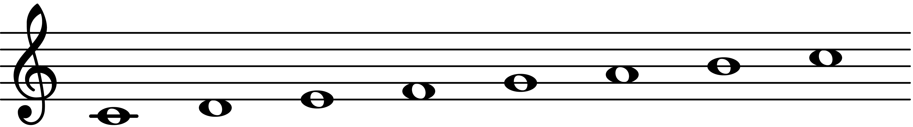
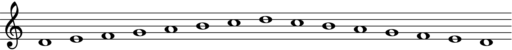

# Scales

Music is an exciting art form and cultural activity that allows you to turn sound into expressions of emotion. The goal of "The Musician's Compendium" is to help you learn the most important aspects of music theory, performance, and recording that will allow you to be an accomplished musician. After reading this book you will have the knowledge to appreciate, understand, and create music in a variety of styles, using what you have learned to express yourself and bring people together.

```{r, echo=FALSE, fig.cap="The C Ionian scale.", fig.align='left', out.width = "564.5px", out.height="79.25px"}

```

Music is an exciting art form and cultural activity that allows you to turn sound into expressions of emotion. The goal of "The Musician's Compendium" is to help you learn the most important aspects of music theory, performance, and recording that will allow you to be an accomplished musician. After reading this book you will have the knowledge to appreciate, understand, and create music in a variety of styles, using what you have learned to express yourself and bring people together.

```{r, echo=FALSE, fig.cap="The D Dorian scale.", fig.align='left', out.width = "802px", out.height="79.25px"}

```