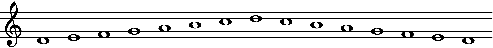

# Scales

Music is an exciting art form and cultural activity that allows you to turn sound into expressions of emotion. The goal of "The Musician's Compendium" is to help you learn the most important aspects of music theory, performance, and recording that will allow you to be an accomplished musician. After reading this book you will have the knowledge to appreciate, understand, and create music in a variety of styles, using what you have learned to express yourself and bring people together.

```{r, fig.cap="The D Dorian scale.", out.width = out_width("d-dorian.png")}

```

lorum ipsum

```{r, fig.cap="The C Ionian scale.", out.width = out_width("c-ionian.png")}
knitr::include_graphics("lilypond/scales/ionian/c/c-ionian.png")
```

lorum ipsum

```{r, fig.cap="tabr tests.", fig.height=6.5}
chords <- c("02210", "32010", "0232", "133211", "022100")
id <- c("Am", "C", "D", "F", "E")

g <- purrr::map2(chords, id, ~{
  tabr::plot_chord(.x, "notes", point_size = 8, fret_range = c(0, 4), accidentals = "sharp", asp = 1.25) + 
    ggplot2::ggtitle(.y)
})

g[[1]] + g[[2]] + g[[3]] + g[[4]] + g[[5]] +
  plot_layout(ncol = 3)
```

#### Template for including exercises

Exercise \@ref(exr:c-ionian) shows an interesting way to play the C Major scale.

```{exercise, c-ionian, name="The C Major Scale", echo=TRUE}
Try playing this at different tempos!
```
```{r, fig.cap="", out.width = out_width("c-ionian.png")}
knitr::include_graphics("lilypond/scales/ionian/c/c-ionian.png")
```

